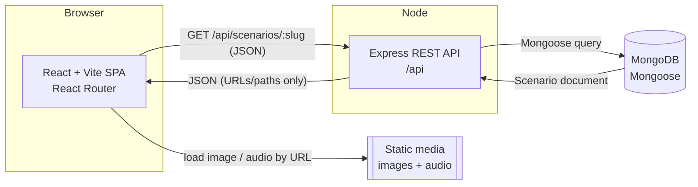

# System Overview

High-level architecture for **Manga English Lab**, a comic-style
English-learning web app for beginner TEFL learners. This document orients a
reader before they dive into the deeper architecture docs linked at the end.

> Scope note: this describes the MVP shape. _Recommended decision_ items may be
> refined during implementation; material changes are recorded as ADRs under
> [`../decisions/`](../decisions/).

## Components

- **Client — React + Vite SPA** _(Recommended decision)_. A single-page app
  using React Router for scenario browsing and conversation playback. Renders
  comic panels, positions speech bubbles from data-driven percentages, and
  plays per-line pronunciation audio.
- **Server — Express REST API** _(Recommended decision)_. A stateless Node.js
  (ES modules) service exposing a small REST surface under `/api`. Reads
  scenario content from MongoDB and returns JSON.
- **Database — MongoDB via Mongoose** _(Confirmed requirement)_. Stores
  scenario content as fully-embedded documents. See
  [`data-model.md`](./data-model.md).
- **Media assets** _(Recommended decision for MVP)_. Panel illustrations and
  audio clips are static files. Initially bundled with / served alongside the
  frontend and referenced by **URL/path only** — **no binaries are stored in
  MongoDB** _(Confirmed requirement)_.

## Diagram



The API returns only structured content and **references** to media; the browser
fetches the actual image and audio bytes directly from the static media source.

## Repository structure

An **npm-workspaces monorepo** _(Recommended decision)_:

```
manga-english-lab/
  client/            # React + Vite SPA (workspace)
  server/            # Express + Mongoose API (workspace)
  docs/              # planning, architecture, decisions (this tree)
  package.json       # workspaces: ["client", "server"]
```

Keeping client and server in one repo simplifies coordinated changes to the API
contract and shared conventions while the project is solo-maintained. See
[`backend-architecture.md`](./backend-architecture.md) for the server's internal
layout.

## Request lifecycle — "load scenario by slug"

1. User navigates to `/scenarios/ordering-at-a-restaurant`. React Router matches
   the route and reads the `slug` param.
2. The SPA issues `GET /api/scenarios/ordering-at-a-restaurant`.
3. Express routes the request to the scenario controller, which validates the
   request shape at the edge (see boundary rules in
   [`backend-architecture.md`](./backend-architecture.md)).
4. A service queries MongoDB via Mongoose for a **published** scenario whose
   `slug` matches. `slug` — not the Mongo `_id` — is the public lookup key
   _(Confirmed requirement)_.
5. If found, the fully-embedded Scenario document (characters, variations,
   panels, dialogue lines, glossary) is returned as JSON. If not found or
   unpublished, the API returns `404`. Error shapes are defined in
   [`api-contract.md`](./api-contract.md).
6. The SPA stores the response in React state, renders the first variation's
   panels, positions bubbles from `bubble` percentages, and wires up audio.

## Where data lives

- **MongoDB** — durable scenario **content**: titles, slugs, characters,
  variations, panels, dialogue lines, glossary, media URLs/paths, and the
  `published` flag. Source of truth for what a scenario _is_.
- **React state** — ephemeral **playback / session / UI** state: which variation
  is selected, current panel/line index, audio playing status, and transient UI
  toggles. Never persisted server-side.
- **Browser storage** — reserved for **future user preferences** (e.g., last
  scenario, autoplay, volume). _(Deferred decision)_ — not used in the MVP.

This separation keeps the API cacheable and stateless: identical content
requests yield identical responses regardless of a user's playback position.

## Non-goals (MVP)

_(Confirmed requirement — explicitly out of scope for the MVP)_

- No authentication, accounts, or user profiles.
- No content-management UI / admin panel — content is created via seed scripts
  (see [`backend-architecture.md`](./backend-architecture.md)).
- No generic branching-dialogue engine — each scenario has exactly **3 complete,
  ordered variations**, not a runtime branch tree.
- No user-generated content, comments, or social features.
- No progress tracking, scoring, or spaced-repetition system.
- No media upload pipeline — media is prepared out-of-band and referenced by URL.

## Related documents

- [`backend-architecture.md`](./backend-architecture.md) — server layering,
  Mongoose connection, validation boundaries, seed strategy.
- [`domain-model-options.md`](./domain-model-options.md) — compared document
  structures and the recommended MVP model.
- [`data-model.md`](./data-model.md) — the recommended Mongoose schemas.
- [`api-contract.md`](./api-contract.md) — REST endpoints and JSON shapes.
- [`../decisions/`](../decisions/) — Architecture Decision Records.
